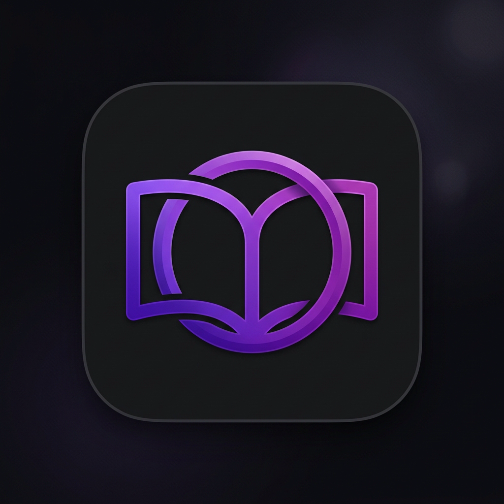

  

  # 🧘 Study Zen
  
  **Your Ultimate All-in-One Productivity & Learning Companion**

  
  
  

 

## ✨ About Study Zen

**Study Zen** is a feature-rich, beautifully designed mobile application built to maximize focus, enhance learning, and keep you healthy. Whether you are coding, preparing for exams, or hitting the gym, Study Zen integrates powerful AI tools, gamified progress tracking, and health metrics into a single seamless experience.

Built natively for **Android** and **iOS** using Flutter.

---

## 🚀 Key Features

*   🤖 **AI Tutor Integration**: Get instant answers, explanations, and code reviews powered by Groq AI.
*   💻 **In-App Code Compiler**: Write, compile, and test your code snippets directly from your phone.
*   🍅 **Pomodoro Timer**: Boost your focus and manage your study sessions effectively.
*   🏆 **Gamification & Leaderboards**: Track your study streaks, earn points, and climb the social leaderboard.
*   🏋️ **Health & Gym Tracker**: Balance the mind and the body. Log your workouts and monitor health metrics.
*   📝 **Interactive Notes & Quizzes**: Organize your subjects, take rich-text notes, and test yourself with custom quizzes.
*   🎨 **Premium UI/UX**: Enjoy a stunning interface featuring dark mode, glassmorphism (`glass_card`), and smooth animations.

---

## 🛠️ Tech Stack

*   **Frontend**: Flutter / Dart
*   **Backend & Auth**: Firebase (Auth, Firestore, Storage)
*   **State Management**: Provider
*   **AI Integrations**: Groq Service
*   **UI/Design**: Google Fonts, Lucide Icons, Flutter Animate, Lottie

---

## 📱 Supported Platforms

This repository focuses exclusively on mobile deployment:
*   ✅ **Android**
*   ✅ **iOS**

*(Web and Desktop environments have been explicitly excluded to ensure a highly optimized mobile-first architecture).*

---

## 📜 License

**Copyright (c) 2026 Afaq Raza. All Rights Reserved.**

This software is the proprietary property of Afaq Raza. 
You may view this code on GitHub for educational or inspection purposes only. 
**You are strictly PROHIBITED from copying, modifying, distributing, or using this code for any commercial or non-commercial purposes.**

Any unauthorized use, reproduction, or distribution of this code will be subject to legal action.
